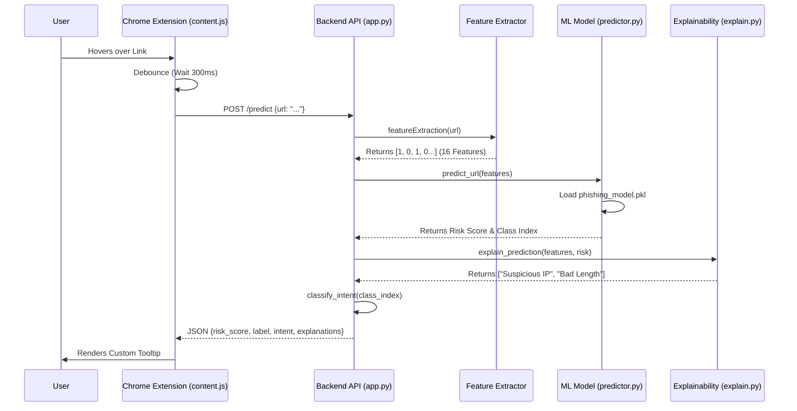

# PhishHover System Flow

This document outlines the complete data lifecycle, from the moment a user hovers over a link to the final risk assessment displayed in the browser.

## 🔄 End-to-End Data Flow



## 📝 Step-by-Step Breakdown

### 1. The Trigger (`extension/content.js`)
*   **Event**: User moves mouse over an `<a>` tag.
*   **Logic**: A timer starts (300ms delay) to prevent spamming requests while moving the mouse quickly.
*   **Action**: If the mouse stays, `content.js` sends an HTTP POST request to `http://localhost:8000/predict` containing the URL.

### 2. The Gatekeeper (`backend/app.py`)
*   **Route**: The request hits the `/predict` endpoint.
*   **Validation**: Pydantic ensures the body contains a valid `url` string.
*   **Allowlist Check**: Specifically checks if the domain is in the `TRUSTED_DOMAINS` list (e.g., google.com). If yes, returns immediately as "Safe".

### 3. Feature Extraction (`backend/features/feature_extractor.py`)
*   **Input**: The raw URL string.
*   **Process**: Converts the URL into **16 numerical inputs** the AI can understand.
    *   *Example*: Does it have an IP address? (1/0)
    *   *Example*: Is the length > 75 chars? (1/0)
    *   *Example*: Does it use a shortening service? (1/0)
*   **Output**: A list of integers, e.g., `[0, 1, 0, 1, 1, ...]`.

### 4. The Brain (`backend/services/predictor.py`)
*   **Input**: The list of 16 features.
*   **Process**: Feeds features into the **XGBoost Classifier** (`phishing_model.pkl`).
*   **Output**:
    *   **Risk Score**: Probability (0.0 to 1.0) of the link being malicious.
    *   **Predicted Class**: The specific type of threat (0=Safe, 1=CredTheft, etc.).

### 5. Contextual Intelligence (`backend/services/intent.py` & `explain.py`)
*   **Intent**: Maps the numeric class ID (e.g., `2`) to a human-readable string (e.g., "Malware Distribution").
*   **Explanations**: Looks at which features contributed most to the decision (using Model Feature Importance) and generates text like "URL contains an IP address".

### 6. The Response
The backend sends a structured JSON response back to the browser:
```json
{
  "risk_score": 0.98,
  "label": "phishing",
  "intent": "Credential Theft",
  "explanations": ["URL contains an IP address"]
}
```

### 7. Visualization (`extension/content.js` & `styles.css`)
*   `content.js` parses the JSON.
*   It creates a DOM element (`div`) with the class `risk-danger` or `risk-safe`.
*   It injects the explanations and intent text.
*   The tooltip appears next to the cursor using absolute positioning.
